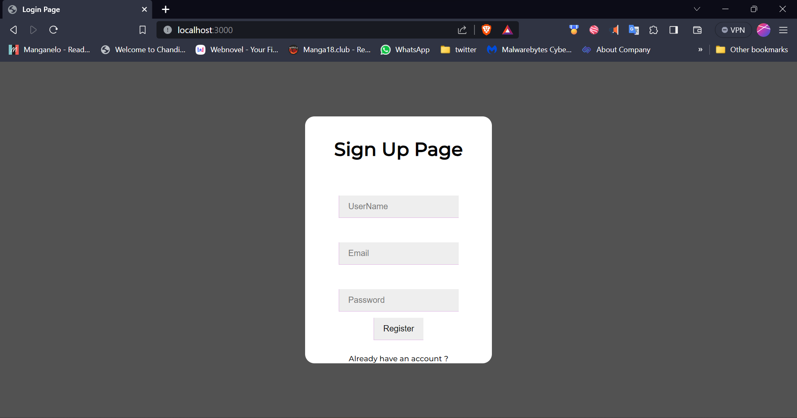
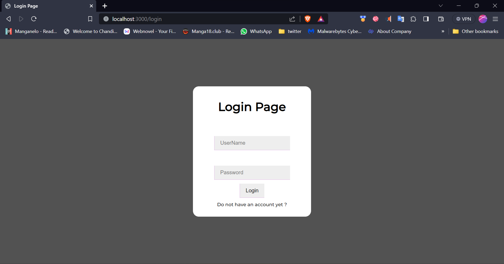
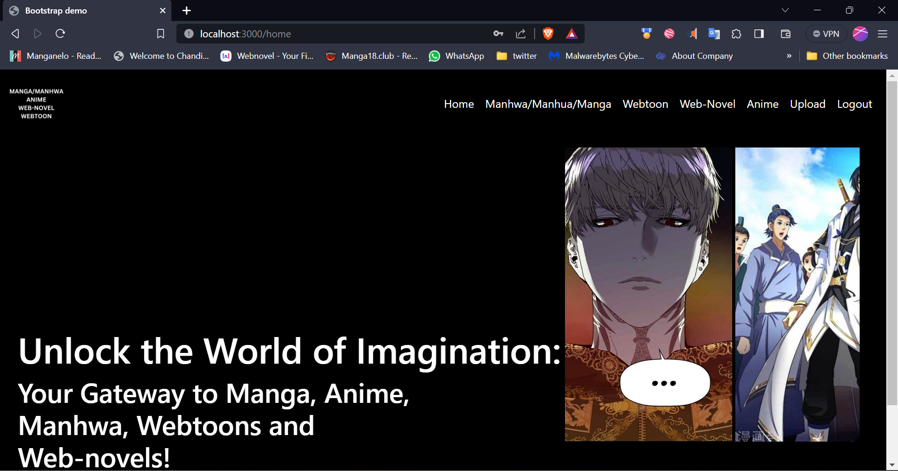
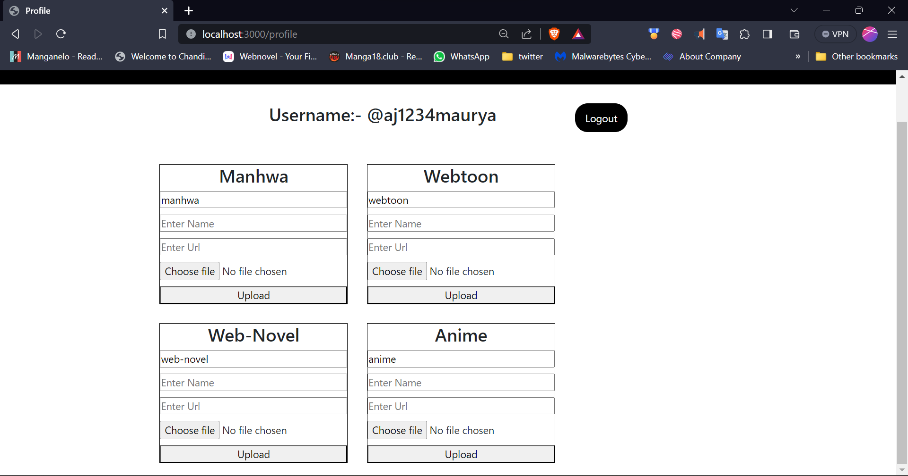
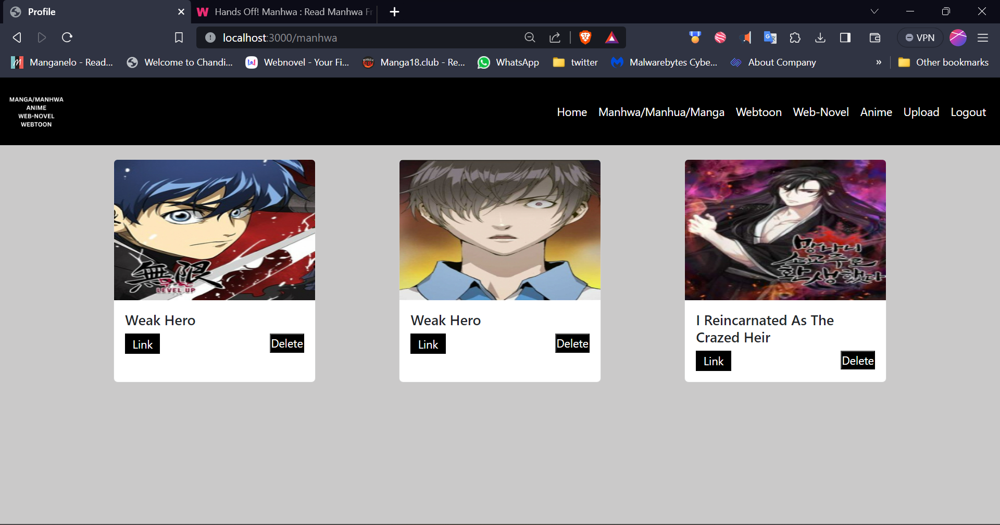
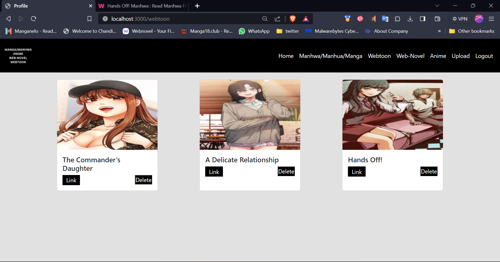

# MyCollection (Manga/Manhwa/Anime/Web-novel/Webtoon)

## Table of Contents

- [Introduction](#introduction)
- [Features](#features)
- [Prerequisites](#prerequisites)
- [Getting Started](#getting-started)
- [Run Application](#run-application)
- [Screenshots](#screenshots)

## Introduction

It's a Node.js and Express-based application that I've put together. For the backend, I'm using Passport.js for user authentication and Express Session to handle session data. The views are done with EJS template. The project lets users register, log in, and log out. There are different sections for anime, manhwa, webtoon, and web-novels, and users can upload content related to these categories. I'm using MongoDB to store all the data. The user interface is quite user-friendly. There's a home page, a profile page, and dedicated pages for each type of content. Users can upload their favorite content, and save it. There is also option to delete the data of the uploaded files.

## Features

1. User Authentication: Users can register, log in, and log out. Passport.js is used for handling user authentication.

2. Session Management: Express Session is implemented for managing user sessions.

3. Content Categories: The project has separate sections for anime, manhwa, webtoon, and web-novels.

4. Content Upload: Users can upload content related to anime, manhwa, webtoon, and web-novels. The content includes a name, URL, and an associated image file.

5. Content Display: The uploaded content is displayed on the respective pages, organized in cards with details and options like viewing links and deleting.

6. MongoDB Integration: MongoDB is used as the database to store user data and content-related information.

7. Dynamic Views with EJS: The views are dynamically generated using EJS templates, allowing for the seamless rendering of content.

8. Navigation: The navigation bar provides links to different sections like Home, Manhwa, Webtoon, Web-Novel, Anime, Profile, and Logout.

## Prerequisites

npm i nodemon -g
npm i ejs
npm i express
npm i mongoose
npm i express-session
npm cookie-parser
npm i connect-flash
npm i passport
npm i passport-local
npm i passport-local-mongoose
npm i morgan
npm i express-validator
npm i uuid multer

## Getting Started

--Clone the repository to your local machine:
--Open in vs code
--npm init
--Install dependencies
--Replace 'dburl' in the 'users.js' file with your MongoDB connection string

## Run Application

--nodemon

## Screenshots

I am attaching some Screenshots

<!-- Register page  -->

<!-- Login page -->

<!-- Home page -->

<!-- Upload Page -->

<!-- Manhwa Page -->

<!-- Webtoon page  -->

